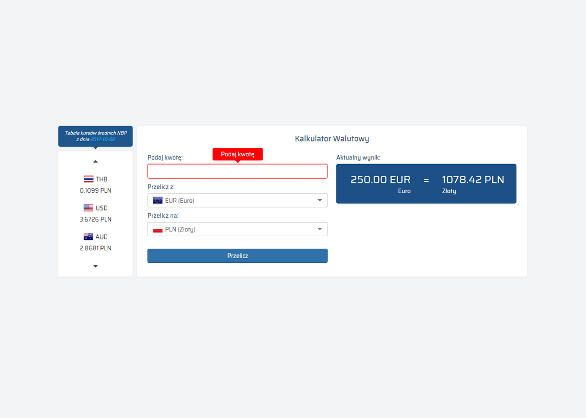

# Kalkulator walutowy
Strona kalkulatora walutowego, korzystająca z aktualnych średnich kursów walut NBP.
Użyte technologie: __HTML5__, __CSS3__, __Bootstrap 3__, __jQuery__, __Ajax__.

### Preview
Zobacz na żywo [tutaj](https://dabrovsky.github.io/Kalkulator_Walutowy/)

